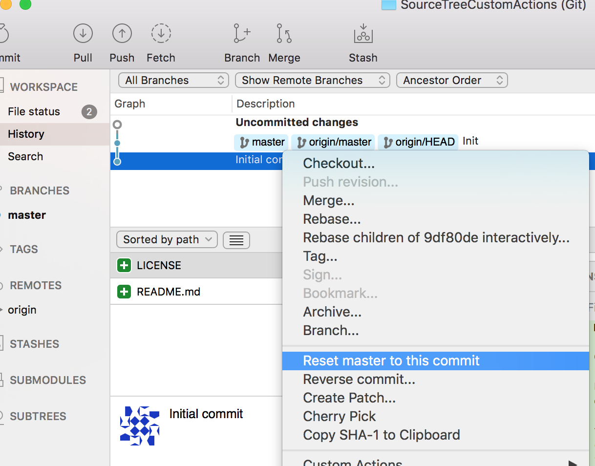
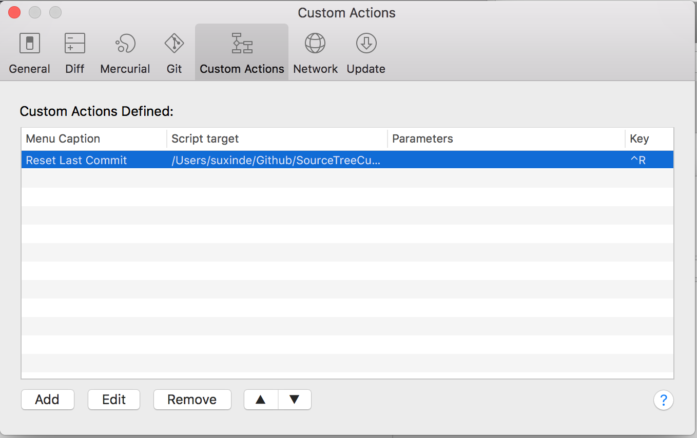
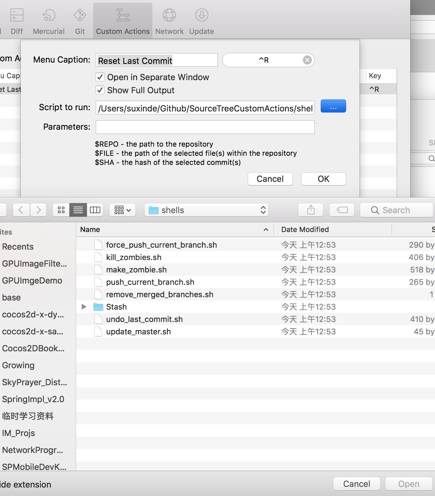

# SourceTree自定义操作

##### 使用场景
> 当我们在某个分支上开发，commit时多提交了几个文件或修改，尚未push，想撤销最近这次commit时，我们一般怎么操作?

这个时候我们一般是在commit里找到这次commit，选中该次提交的前一次提交，右键鼠标，

此处，除了这种方式之外，SourceTree提供了一种便捷的方式，即使用SourceTree的自定义操作(Custom Action). 通过Custom Action，我们可以通过 自定义快捷键 触发我们给定的shell脚本来执行一些我们期望的操作，例如上述例子中的使用场景。

##### 言归正传，开工

1) 首先在SourceTree的Preferences设置窗口中找到Custom Actions。
 

2) 点击添加（Add）添加自定义操作

 

说明：

| 字段名 |  内容  |
|:-----:|:-----:|
| Menu Caption | **菜单上显示的名称**  |
| Script to run| **要执的shell脚本的路径** |
| Parameters   | **想要传给脚本的参数** |

其中 **Menu Caption** 右边可输入该自定义操作的快捷键。

##### 参考

[强大的Git客户端：SourceTree插件开发指南](http://blog.csdn.net/longlongago2000/article/details/51541495)

[Github: SourceTreeX](https://github.com/yzhong52/SourceTreeX)

dfd
